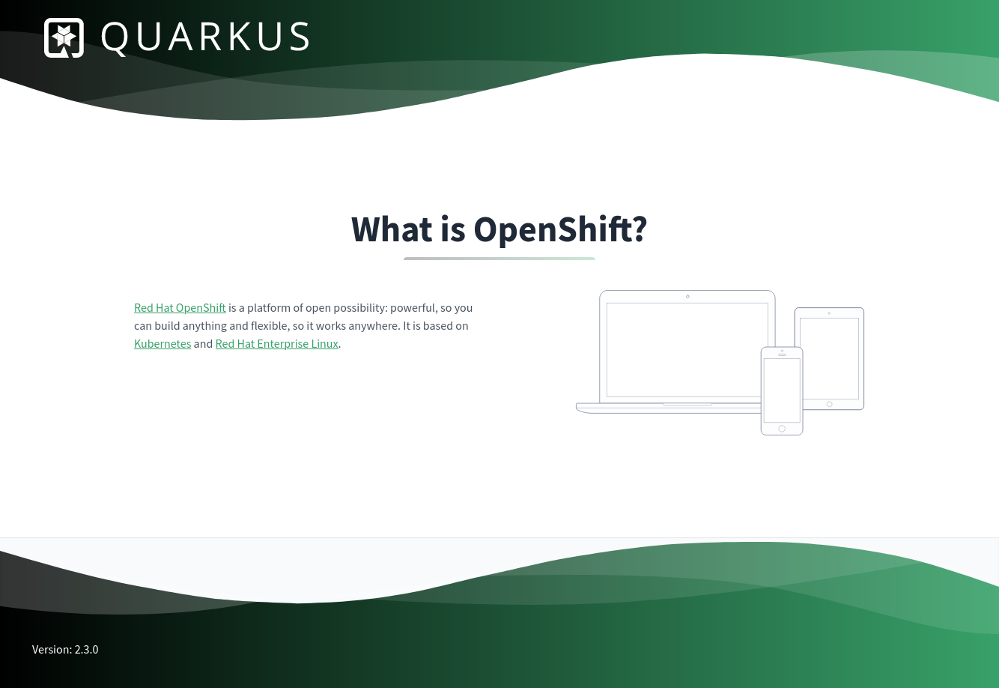

# color-service

This project is a sample project for [Quarkus](https://quarkus.io/), [Kubernetes](https://kubernetes.io/), [OpenShift](https://www.openshift.com/), [Helm](https://helm.sh), [Tekton](https://tekton.dev/) and [Knative](https://knative.dev/).



It is based on [Quarkus](https://quarkus.io/). It exposes a web interface as seen above, which runs some Simple JavaScript code that calls the /color and the /version webservice. The color service just returns a color as a word and as hex code. This color can be changed using an environment variable (COLOR_SERVICE_COLOR), or using a Java property called color-service.color. The UI then changes it's color according to the color that the service returns.

It also exposes some metrics at `/q/metrics` which can be ingested by [Prometheus](https://prometheus.io).

This can be useful to demonstrate cloud native mechanisms, such as [blue-green deployments](https://developers.redhat.com/blog/2022/10/07/coming-terms-bluegreen-deployment), configuring services using environment variables, observability, etc.

## Prerequisites

In order to run this example, you'll need:

* An installation of Git to clone this repository
* A working installation of a JVM >=11
* The Client binaries for
  * OpenShift (oc)
  * KNative
  * Tekton
  * Helm
* Podman and Buildah if you want to run and build the container locally. Docker should also work, but it has not been tested.
* Access to a Red Hat OpenShift with OpenShift Pipelines (Tekton) and Serverless (Knative) enabled. The installation should work on the [OpenShift Sandbox](https://developers.redhat.com/developer-sandbox), which provides a temporary development environment.

The setup has been tested and verified on a Fedora 37 installation, deploying to OpenShift Sandbox.

When running the commands below, it is assumed that you run them while your shell working directory points to the root of this Git repository.

## Development

### Running the Application in dev mode

You can run your application in dev mode that enables live coding using:

```bash
./mvnw quarkus:dev
```

You can access the application by pointing your browser to http://localhost:8080. In Quarkus Dev mode, you can also explore the internals of your application by navigating to http://localhost:8080/q/dev/.

### Packaging and running the application

The application can be packaged using the following command: 

```bash
./mvnw clean package
```

It produces the `color-service-<version>.jar` file in the `/target` directory.
Be aware that it’s not an _über-jar_ as the dependencies are copied into the `target/lib` directory.

The application is now runnable using the following command:

```bash
java -jar target/quarkus-app/quarkus-run.jar
```

### Creating a native executable

You can create a native executable using: 

```bash
./mvnw package -Pnative
```

Or, if you don't have GraalVM installed and have [podman](https://podman.io) available, you can run the native executable build in a container using:

```bash
./mvnw package -Pnative -Dquarkus.native.container-build=true -Dquarkus.native.container-runtime=podman
```

You can then execute your native executable using the following command:

```bash
./target/color-service-<version>-SNAPSHOT-runner
```

If you want to learn more about building native executables, please consult https://quarkus.io/guides/building-native-image.

## Build Container Image

### JVM

```bash
buildah bud -f src/main/docker/Dockerfile.jvm -t quay.io/jritter/color-service:latest
```

### Native

```bash
buildah bud -f src/main/docker/Dockerfile.native -t quay.io/jritter/color-service:latest-native
```

## Run the color-service locally

Color service can be run just as any other container. It has been tested using podman. The container exposes the Quarkus default port 8080 for its webservice:

### JVM

```bash
podman run -p 8080:8080 -e COLOR_SERVICE_COLOR=blue -it quay.io/jritter/color-service:latest
```

### Native

```bash
podman run -p 8080:8080 -e COLOR_SERVICE_COLOR=blue -it quay.io/jritter/color-service:latest-native
```

## Deploying color-service on Kubernetes

It would be nice if we could run this example application on a Kubernetes Cluster. This chapter outlines a bunch of options to deploy this application.

### Helm

This chapter covers the deployment of the color service using [Helm](https://helm.sh).

#### Deploy color-service using Helm

This service can be deployed using a Helm chart.

```bash
helm upgrade --install color-service-helm helm/color-service
```

#### Change the color using Helm

```bash
helm upgrade color-service-helm helm/color-service --set color=yellow
```

Possible colors are:

* red
* green
* blue
* yellow

#### Update the number of replicas of the color service deployment

```bash
helm upgrade color-service-helm helm/color-service --set replicaCount=1
```

#### Delete color-service using Helm

```bash
helm uninstall color-service-helm
```

### Knative

This chapter covers the deployment of the color service using [Knative](https://knative.dev).

#### Deploy color-service using Knative

This is one option to deploy a service using the `kn` command line client. It correctly configures the resource configuration, the labels, the annotations for Prometheus scraping, and it also configures the color by setting the environment variable COLOR_SERVICE_COLOR to blue.

```bash
kn service create color-service-kn --image quay.io/jritter/color-service:2.3.0 --request cpu=100m,memory=256Mi --limit cpu=200m,memory=512Mi -l app.openshift.io/runtime=quarkus -a app.openshift.io/vcs-ref=refs/heads/develop -a app.openshift.io/vcs-uri=https://github.com/jritter/color-service -a prometheus.io/scrape=true -a prometheus.io/path=/q/metrics -a prometheus.io/port=8080 -a autoscaling.knative.dev/target=20 -a autoscaling.knative.dev/metric=rps -e COLOR_SERVICE_COLOR=yellow
```

Note how this configuration configures the resources, the Prometheus scrape parameters and the autoscaler.

#### Change the color using Knative

```bash
kn service update color-service-kn -e COLOR_SERVICE_COLOR=blue
```

Possible colors are:

* red
* green
* blue
* yellow

#### Exploring blue green Deployments

Blue green deployments are a way to try out a new deployment by gradually shifting traffic from an old to a new deployment.

##### Tag deployment and keep traffic on it

```bash
$ kn revision list -s color-service-kn
NAME                  SERVICE         TRAFFIC   TAGS   GENERATION   AGE    CONDITIONS   READY   REASON
color-service-00002   color-service   100%             2            74s    4 OK / 4     True    
color-service-00001   color-service                    1            106s   4 OK / 4     True    
```

Find the name of the revision you want to keep traffic on. We'll continue with color-service-00002 in this example, but this might be different in your environment. Now we are ready to tag this revision. We'll use this tag later to keep traffic on it.

```bash
kn service update color-service-kn --tag color-service-kn-00002=blue
```

##### Deploy a green service

```bash
kn service update color-service-kn -e COLOR_SERVICE_COLOR=green --traffic=blue=100
```

Note that the URL still serves the blue revision. This can be verified by running the following command:

```bash
$ kn revision list -s color-service-kn
NAME                  SERVICE         TRAFFIC   TAGS   GENERATION   AGE     CONDITIONS   READY   REASON
color-service-00003   color-service                    3            31s     4 OK / 4     True    
color-service-00002   color-service   100%      blue   2            2m26s   4 OK / 4     True    
color-service-00001   color-service                    1            2m58s   3 OK / 4     True    
```

Note that the revision name of the newly deployed service is `color-service-00003`

##### Tag the green service and test it

Now we are ready to tag the green service and test it.

```bash
kn service update color-service-kn --tag color-service-kn-00003=green
```

Even though we don't shift any traffic to that revision yet, we can test it by navigating to the URL, and prepending `green-` to the hostname in the URL.

##### Shifting load to the green deployment

Now we can try slowly to shift traffic to the green deployment.

```bash
kn service update color-service-kn --traffic=blue=80,green=20
```

##### Shift all the load to the green deployment

The testing seems to be successful, so let's activate it for good:

```bash
kn service update color-service-kn --traffic=@latest=100
```

##### Untag the Revisions

```bash
kn service update color-service-kn --untag=blue,green
```


#### Exploring the autoscaler

When deploying a service using Knative, the autoscaler can be used. During the deployment of the service above, we configured annotations that tell the [autoscaler](https://knative.dev/docs/serving/autoscaling/) to have 20 requests per seconds per pod. The autoscaler tries to match this target by adding or removing replicas. This is a very low value, and in a production setup this value would be higher. But it allows us to explore the effects of the autoscaler. [Siege](https://github.com/JoeDog/siege/) can be used to generate some load and see what happens with the autoscaler.

```bash
siege -c 10 <url>
```

#### Delete color-service using Knative

```bash
kn service delete color-service-kn
```
